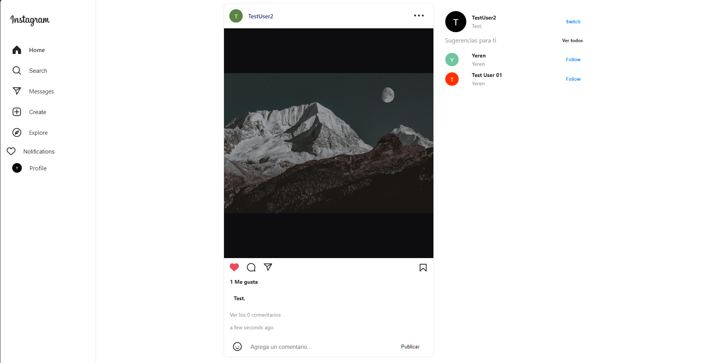
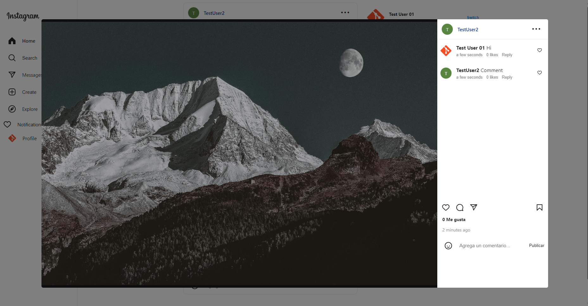

# Instagram Clone




## Descripción del Proyecto
Este proyecto es el un clon Backend de instagram desarrollado como parte de  aprendizaje en el desarrollo backend. Incluye funciones básicas como registro de usuarios, subida de imágenes, seguir a otros usuarios, comentarios y chat en tiempo real con websocket.

## Características
- Registro de usuarios
- Subida de imágenes
- Seguir a otros usuarios
- Comentarios en publicaciones
- Chat en tiempo real con Django Channels

## Tecnologías Utilizadas
- Python
- Django
- React
- PostgreSQL
- Django Channels

## Instrucciones de Configuración y Ejecución
1. Clonar repositorio.
2. Crear archivo .env con las siguientes variables
``` .env
DB_USER=postgres
DB_HOST=host.docker.internal
DB_PORT=5432
DB_NAME=ig
DB_PASSWORD=1234
CELERY_BROKER_REDIS_URL=redis://host.docker.internal:6379
REDIS_HOST=host.docker.internal

# Docker
DATABASE_PATH=C:\Users\USUARIO\postgres_docker\
APP_PORT=8000
APP_HOST=0.0.0.0
```
3. Ejecutar el comando ```docker compose up```
4. Clonar el siguiente repositorio del frontend con React js https://github.com/YerenPalacios/instagram-react.git
